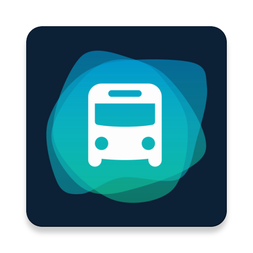

# TrafficSwipe
 

TrafficSwipe is a responsive and fast navigation app for public transportation. You can use it with 
one hand to get vehicles or navigate in Dresden.

It is build by [Paul] and [Philipp]. We are using the external resources or libraries:

* [jVVO] for API calls
* [Icons8] for a few icons
* [Google Fonts] for the ui font

You can see ui mock-ups in our presentation [here](http://www1.inf.tu-dresden.de/~ts2/admuc/seminar1920/first/group01.pdf)

  [Paul]: <https://orlopau.dev/>
  [Philipp]: <https://PNG.Services>
  [jVVO]: <https://github.com/PhilippMatthes/jVVO>
  [Icons8]: <https://icons8.com/>
  [Google Fonts]: <https://fonts.google.com/>